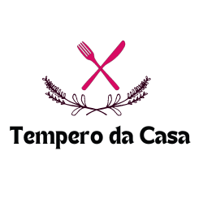

# Tempero da Casa 🍴✨

Bem-vindo ao repositório do **Tempero da Casa**! Este projeto é o coração digital do nosso restaurante, onde tradição e inovação se encontram para oferecer uma experiência gastronômica única. A seguir, você encontrará uma visão geral divertida e detalhada de como tudo funciona e como você pode contribuir.

## Índice 📖

1. [Visão Geral](#visão-geral-)
2. [Tecnologias Utilizadas](#tecnologias-utilizadas-)
3. [Como Usar](#como-usar-)
4. [Seções do Site](#seções-do-site-)
5. [Como Contribuir](#como-contribuir-)
6. [Licença](#licença-)

## Visão Geral 🎉

O **Tempero da Casa** é um projeto web desenvolvido para proporcionar aos nossos clientes uma experiência digital tão incrível quanto a nossa comida! Este repositório contém todo o código fonte do nosso site, desde a estrutura HTML até os estilos CSS e funcionalidades JavaScript.

## Tecnologias Utilizadas 🛠️

- **HTML5**: Estrutura básica do site.
- **CSS3**: Estilização com foco em responsividade e design atrativo.
- **JavaScript**: Funcionalidades interativas.
- **Font Awesome & Bootstrap Icons**: Ícones estilosos e funcionais.

## Como Usar 🚀

### Pré-requisitos

Antes de começar, você precisará ter instalado em sua máquina:

- Um navegador web (Google Chrome, Firefox, etc.)
- Um editor de texto (VSCode, Sublime Text, etc.)

### Instalação

1. Clone o repositório:
   ```bash
   git clone https://github.com/seu-usuario/tempero-da-casa.git
2. Navegue até o diretório do projeto:
   cd tempero-da-casa
3. Abra o arquivo index.html no seu navegador.

Seções do Site 🍲
Menu 📜
Logo e Título: A identidade visual do nosso restaurante.
Navegação: Links para as principais seções do site.
Home 🏠
Bem-vindo: Uma mensagem calorosa para os visitantes.
Botões Interativos: Links para os menus de pratos especiais, sobremesas e reservas via WhatsApp.
Sobre Nós 👨‍🍳👩‍🍳
História: Conheça a origem do Tempero da Casa e a paixão dos fundadores pela culinária.
Filosofia: Nossa dedicação em tornar cada refeição uma experiência memorável.
Cardápio 🍽️
Pratos e Sobremesas: Descrições apetitosas de alguns dos nossos pratos mais populares, cada um com imagens deliciosas.
Contatos 📞
Redes Sociais: Links para nossas páginas no Instagram, Facebook e WhatsApp.
Contato Rápido: Um botão flutuante do WhatsApp para facilitar a comunicação com nossos clientes.
Como Contribuir 🤝
Adoramos colaborações! Se você quer ajudar a melhorar este projeto, siga estes passos:

1. Faça um fork do projeto.
2. Crie uma nova branch:
git checkout -b minha-nova-funcionalidade
3. Faça suas alterações e commit:
git commit -m 'Adiciona nova funcionalidade'
4. Envie para o repositório principal:
git push origin minha-nova-funcionalidade
Abra um Pull Request.
Licença 📄
Este projeto está licenciado sob a licença MIT. Consulte o arquivo LICENSE para mais informações.

Feito com 💖 e muito sabor por Roberta de Oliveira e Bárbara Letícia.


